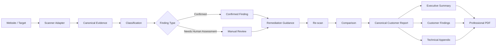

# AccessAudit

### Accessibility Compliance & Evidence Platform

AccessAudit is a desktop-first accessibility compliance platform designed to transform automated scan results into structured evidence, human review, remediation guidance, re-scan comparison, and professional customer reporting.

This public repository is a **portfolio representation** of the project. The production source code, internal operational configuration, and proprietary implementation remain private.

---

## Product Direction

AccessAudit is built around a full compliance workflow rather than a one-off scanner:

> **Scan → Evidence → Review → Remediation → Re-scan → Comparison → Compliance Report**

Automated scanning is only one input into the system. The product is designed to preserve evidence, distinguish confirmed issues from cases requiring manual assessment, and produce professional reporting suitable for technical and business stakeholders.

---

## Core Capabilities

### Accessibility Scanning
Automated scan results are ingested through a scanner-adapter boundary rather than being treated as the product itself.

The architecture is designed so scanner output becomes structured local evidence that downstream review, remediation, comparison, and reporting can rely on.

### Evidence Preservation
AccessAudit preserves technical context needed to understand and reproduce findings, including representative evidence such as:

- selectors,
- HTML snippets,
- failure summaries,
- technical checks,
- related targets,
- rule identifiers,
- source help references,
- contrast-related evidence where available.

### Confirmed vs Manual Review
The system explicitly separates findings that can be established automatically from cases that require human assessment.

This prevents automated tooling from presenting uncertain accessibility conditions as confirmed facts.

### Remediation Workflow
Findings are presented with remediation guidance and structured evidence so developers and reviewers can move from detection toward correction.

### Re-scan & Comparison
The product architecture supports re-testing after remediation and comparison between previous and current accessibility states.

This shifts the workflow from a static audit toward measurable improvement.

### Professional Compliance Reporting
AccessAudit produces a customer-facing PDF reporting pipeline with a clear information hierarchy:

1. **Executive Summary**
2. **Customer Findings**
3. **Technical Appendix**

Representative examples are selected deterministically so reports remain concise without hiding the true number of affected elements.

### Deterministic Reporting
Canonical report data remains authoritative while presentation layers derive customer-facing output from the same source of truth.

The reporting pipeline avoids silently changing evidence merely to improve presentation.

---

## Architecture

The Desktop UI is intentionally separated from core business logic. Scanner integrations are adapters, evidence remains authoritative, and PDF generation passes through a dedicated reporting pipeline.

See [Architecture Overview](docs/ARCHITECTURE.md).

---

## Reporting Principles

AccessAudit treats reporting as an engineering system, not a document dump.

Key principles include:

- canonical evidence remains authoritative,
- affected-element counts remain truthful,
- representative examples are bounded and deterministic,
- customer-facing narrative is separated from raw source evidence,
- manual-review findings are clearly distinguished from confirmed violations,
- technical detail remains available for developers,
- presentation changes do not rewrite canonical findings,
- PDF pagination and layout are regression-tested.

See [Reporting Pipeline](docs/REPORTING_PIPELINE.md).

---

## Reliability & Validation

The private production repository has been developed through staged architecture and validation work.

Recent validation milestones include:

- **1,700+ passing tests** in the full production suite,
- more than **2,000 subtests** across the validation surface,
- focused professional-PDF regression suites,
- canonical report compatibility checks,
- Python compilation checks,
- Git diff integrity checks,
- GitHub Actions validation,
- real Chromium PDF generation,
- page-by-page visual inspection of generated customer reports,
- regression coverage for long evidence, contrast presentation, representative-example selection, and pagination.

The focus is not raw test count. The purpose is to protect evidence integrity, deterministic reporting behavior, and customer-facing output across changes.

---

## Technology

The private production implementation includes technologies and tooling such as:

- **Python**
- **Playwright**
- **Chromium**
- **axe-core based accessibility scanning integration**
- **GitHub Actions**
- **Automated testing**
- **Professional PDF reporting**
- deterministic canonical report projection

---

## My Role

I designed and developed AccessAudit as an end-to-end product and engineering project, including:

- product and workflow design,
- desktop-first architecture,
- scanner-adapter boundaries,
- evidence-preservation model,
- confirmed/manual-review classification boundaries,
- remediation workflow design,
- re-scan and comparison architecture,
- professional PDF reporting,
- deterministic presentation rules,
- validation and regression strategy,
- architecture and governance boundaries.

The system was developed iteratively with explicit architecture constraints and production-oriented validation rather than treating accessibility scanning as an isolated script.

---

## Important Compliance Boundary

AccessAudit does **not** claim that automated scanning alone proves legal accessibility compliance.

Automated tools can identify many machine-detectable issues, but some accessibility requirements require human review, contextual interpretation, or user testing. The system architecture preserves this distinction instead of collapsing all results into automated pass/fail claims.

---

## What This Repository Contains

This repository intentionally contains portfolio-safe material only:

- product overview,
- architecture overview,
- accessibility workflow,
- reporting-pipeline description,
- engineering highlights,
- CV-ready project descriptions.

It does **not** contain:

- production source code,
- customer data,
- credentials,
- private infrastructure details,
- proprietary implementation internals,
- deployment secrets.

---

## Project Status

**Production-oriented accessibility compliance and reporting system under active development.**

The private codebase includes a mature evidence and reporting pipeline with professional customer PDF output, deterministic evidence selection, Swedish customer-facing narrative, manual-review handling, and extensive automated validation.

---

## Recruiter / Engineering Review

If you are reviewing this project as part of a hiring process, the most relevant sections are:

1. [Architecture Overview](docs/ARCHITECTURE.md)
2. [Accessibility Workflow](docs/ACCESSIBILITY_WORKFLOW.md)
3. [Reporting Pipeline](docs/REPORTING_PIPELINE.md)
4. [Engineering Highlights](docs/ENGINEERING_HIGHLIGHTS.md)
5. **My Role** above

Private implementation details can be discussed at an appropriate level during an interview.

---

## Author

**Alireza Habibian**  
GitHub: [@ahabibian](https://github.com/ahabibian)

---

> Portfolio note: AccessAudit's production repository is intentionally private. This repository documents the engineering approach without publishing proprietary implementation or sensitive operational material.
