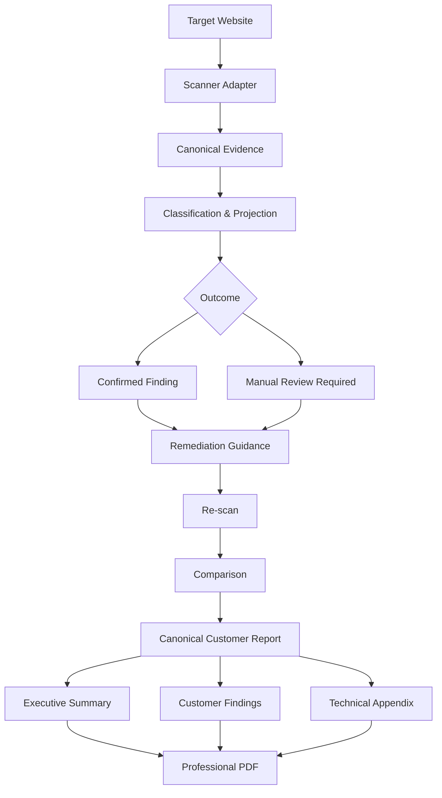

# AccessAudit Architecture Overview

## Objective

AccessAudit is designed as a desktop-first accessibility compliance and reporting system.

The architecture is intentionally broader than a scanner. Its purpose is to move accessibility work through a governed lifecycle:

**Scan → Evidence → Review → Remediation → Re-scan → Comparison → Compliance Report**

## Logical Flow

## Scanner Boundary

The scanner is an adapter, not the product.

This is important because accessibility tooling can change over time, while the product still needs stable internal contracts for:

- evidence,
- classification,
- remediation,
- review,
- comparison,
- reporting.

## Canonical Evidence

Scan output is transformed into structured evidence that downstream components can rely on.

The architecture is designed to preserve technical context such as selectors, HTML snippets, failure summaries, related targets, technical checks, rule identifiers, and contrast-related evidence where available.

## Classification Boundary

The system separates machine-detectable confirmed findings from cases requiring human assessment.

This avoids a common failure mode in accessibility tooling: presenting uncertain conditions as if automation had proven them.

## Presentation Boundary

Customer-facing PDFs are presentation derivatives of canonical report data.

Presentation logic may choose representative examples or reformat evidence, but it does not become the source of truth for accessibility findings.

## Desktop Boundary

The desktop interface is kept separate from core business logic.

This makes workflow logic, evidence processing, reporting, and validation independently testable instead of coupling them to UI state.

## Re-scan and Comparison

Accessibility work is iterative. The architecture therefore treats re-scan and comparison as first-class workflow stages rather than post-processing ideas.

The intended outcome is a traceable progression from finding to remediation to measurable verification.

## Compliance Boundary

AccessAudit does not equate automated scanning with legal compliance certification.

Some accessibility criteria require human review, contextual interpretation, or user testing. The architecture preserves this distinction and makes uncertainty visible.

## Public Portfolio Boundary

This document intentionally excludes production source code, proprietary implementation details, customer data, credentials, and private infrastructure information.
